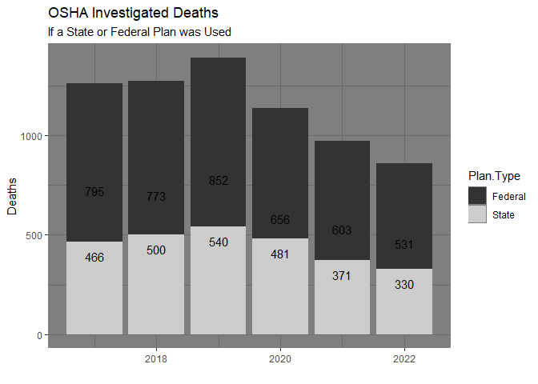

Deaths Investigated by OSHA
================
Kit Applegate
2023-06-27

This page provides data on work-related fatalities that occurred under
Federal OSHA and State Plan jurisdiction for cases that have been closed
or citations issued on or after January 1, 2017. The data can be found
at this
[Link](https://www.osha.gov/fatalities#&sort%5B#incSum%5D=0-1-1-0).

#### Deaths by year

    ## # A tibble: 7 × 2
    ##    Year Deaths.by.Year
    ##   <dbl>          <int>
    ## 1  2019           1392
    ## 2  2018           1273
    ## 3  2017           1261
    ## 4  2020           1137
    ## 5  2021            974
    ## 6  2022            861
    ## 7  2023             52

The data reveals the number of deaths per year and whether citations
were provided, indicating a trend where citations were frequently
absent.

<!-- -->

In the graph, it is evident that the majority of the plans utilized were
of the federal variety.

<!-- -->

<!-- -->

<!-- -->
